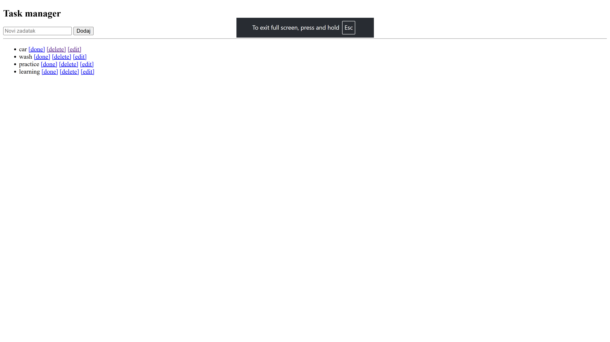
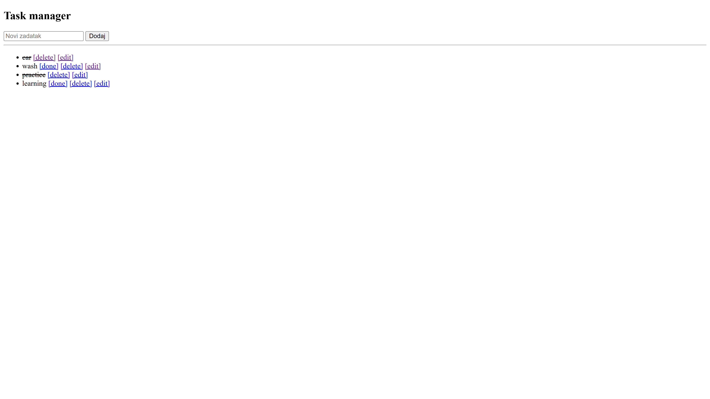

# Flask Task Manager

Simple task management web application built with Flask.

## Features
- Create tasks
- Edit tasks
- Delete tasks
- Mark tasks as completed

## Tech Stack
- Python
- Flask
- SQLite
- HTML / CSS

## Live Demo
[https://your-task-manager.onrender.com](https://flask-task-manager-api.onrender.com/)

## Preview

